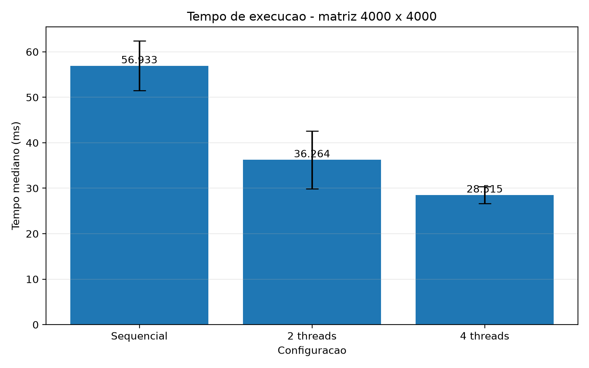
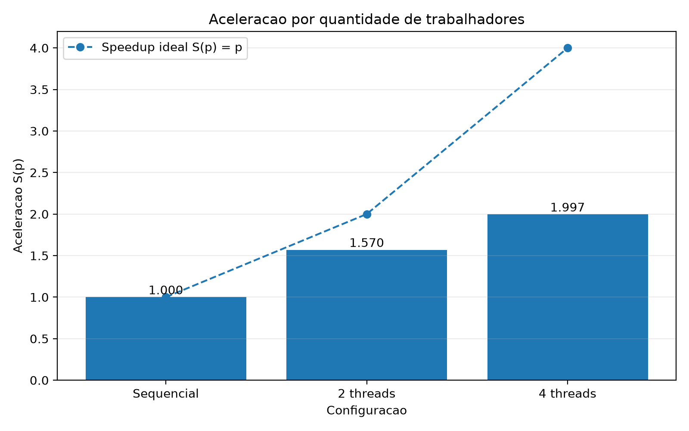
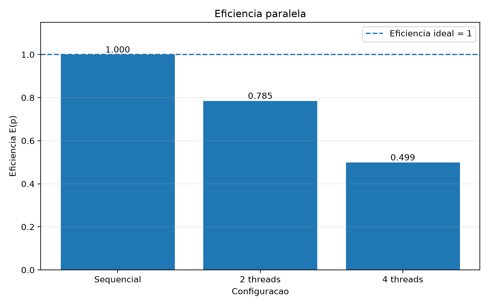

# Relatório técnico - Contagem paralela de objetos em uma matriz binária

> **Disciplina:** Sistemas Operacionais - 2026/II  
> **Professor:** Prof. Filipo Novo Mór  
> **Instituição:** Pontifícia Universidade Católica do Rio Grande do Sul - Escola Politécnica    
> **Repositório:** https://github.com/EduardoWachter/Deteccao_Objetos
> **Versão do relatório:** 3.0  
> **Data:** 06/10/2026

## Identificação

| Campo | Informação |
|---|---|
| Integrante 1 | Eduardo Dieter Wachter |
| Matrícula do integrante 1 | 24200503 |
| Integrante 2 | João Paulo Fritsch dos Santos |
| Matrícula do integrante 2 | 23103898 |
| Integrante 3 | Juliana Scapini Consoli |
| Matrícula do integrante 3 | 24280057 |
| Integrante 4 | Júlia Santos de Melo |
| Matrícula do integrante 4 | 24103892 |
| Modalidade | Grupo de 4 integrantes |
| Turma | 330 |
| Estratégia paralela | Pthreads |
| Plataforma testada | macOS |
| Commit avaliado | 66c2b3743dfa0aa6fc9fab62d6e93e086b80ef64 |

## Resumo

Este trabalho apresenta uma implementação sequencial e uma implementação paralela para a contagem de objetos em uma matriz binária. Um objeto é definido como um componente de células de valor `1` conectado por qualquer um dos oito vizinhos possíveis, incluindo diagonais. A versão sequencial utiliza busca em profundidade iterativa, com vetor de visitados e pilha explícita. A versão paralela utiliza Pthreads e divide a matriz em faixas horizontais de linhas; cada thread identifica componentes locais de forma independente e, após a sincronização por `pthread_join`, os rótulos são convertidos para identificadores globais e consolidados com Union-Find. As cinco matrizes obrigatórias produziram as contagens esperadas nas versões sequencial, com 2 threads e com 4 threads. Em uma matriz adicional de 4000 × 4000, com 6400 objetos, foram obtidos tempos medianos de 56,933 ms na versão sequencial, 36,265 ms com 2 threads e 28,515 ms com 4 threads. As acelerações foram de aproximadamente 1,570 e 1,997, demonstrando ganho de desempenho com o paralelismo para a entrada de maior porte.

**Palavras-chave:** sistemas operacionais; paralelismo; Pthreads; conectividade 8; flood fill; componentes conexos; Union-Find.

## 1. Visão geral do problema

O programa trabalha com uma matriz binária na qual `0` representa o fundo da matriz e `1` representa parte de um objeto. Um objeto corresponde a um componente de células de valor `1` conectadas horizontalmente, verticalmente ou diagonalmente, seguindo a **conectividade 8**.

O projeto contém duas implementações funcionalmente equivalentes:

1. uma versão sequencial, usada como referência de correção e desempenho;
2. uma versão paralela baseada em Pthreads, com decomposição da matriz em faixas horizontais de linhas.

### 1.1 Objetivos da implementação

- Contar corretamente os objetos com conectividade 8.
- Manter uma versão sequencial como referência de correção e desempenho.
- Distribuir trabalho efetivo entre duas ou mais threads.
- Reconhecer e unificar objetos que atravessem as divisões da matriz.
- Produzir resultados determinísticos e idênticos nas versões sequencial e paralela.
- Evitar condições de corrida, deadlocks, atualizações perdidas e contagens duplicadas.
- Avaliar a sobrecarga e o desempenho da solução paralela.

### 1.2 Requisitos atendidos

| Requisito | Como foi atendido | Evidência no repositório |
|---|---|---|
| ANSI C C89/C90 | Código ajustado para C89/C90 e compilado com `-std=c89 -Wall -Wextra -pedantic`. | `Sequencial.c`, `paralelo.c`, `casos.h`, `Executar.sh` |
| Conectividade 8 | As buscas verificam os oito vizinhos; a consolidação entre faixas inclui conexões verticais e diagonais. | `Sequencial.c` e `paralelo.c` |
| Versão sequencial | DFS iterativa com vetor de visitados e pilha explícita. | `Sequencial.c` |
| Versão paralela | Pthreads, divisão por faixas de linhas, rotulação local e Union-Find. | `paralelo.c` |
| Duas ou mais unidades concorrentes | A execução padrão testa 2 e 4 threads. | `Executar.sh` e `resultado_paralelo.txt` |
| Quantidade configurável de trabalhadores | As duas quantidades podem ser informadas por argumentos da linha de comando. | `./Paralelo 2 4` |
| Consolidação entre regiões | Rótulos locais recebem offsets globais e equivalências de fronteira são unidas. | `paralelo.c` |
| Tratamento horizontal, vertical e diagonal | A conectividade 8 é preservada durante a busca local, verificando vizinhos horizontais, verticais e diagonais. Na consolidação entre faixas, são verificadas a célula diretamente abaixo e as duas células diagonalmente adjacentes. | `Sequencial.c` e `paralelo.c` |
| Verificação das chamadas POSIX | Retornos de `clock_gettime`, `pthread_create` e `pthread_join` são verificados. | `Sequencial.c` e `paralelo.c` |
| Liberação dos recursos | As estruturas alocadas dinamicamente são liberadas com `free`, e todas as threads criadas são finalizadas e aguardadas com `pthread_join`. | `Sequencial.c`, `paralelo.c` e `casos.h` |
| Compilação reproduzível | O script `Executar.sh` contém os comandos necessários para compilar e executar as versões sequencial e paralela com as mesmas opções de compilação. | `Executar.sh` e `README.md` |

## 2. Organização do repositório

A estrutura atual do projeto mantém as implementações, os casos de teste, os resultados e a documentação diretamente na raiz do repositório.

```text
.
├── .gitignore
├── README.md
├── RELATORIO_TECNICO.md
├── RELATORIO_TECNICO.pdf
├── Sequencial.c
├── paralelo.c
├── casos.h
├── Executar.sh
├── resultado_sequencial.txt
├── resultado_paralelo.txt
├── grafico-tempo.png
├── grafico-aceleracao.png
└── grafico-eficiencia.png
```

| Caminho | Finalidade |
|---|---|
| `README.md` | Descrição do projeto, compilação, execução e arquitetura resumida. |
| `RELATORIO_TECNICO.md` | Relatório técnico em Markdown. |
| `RELATORIO_TECNICO.pdf` | Versão PDF do mesmo relatório técnico. |
| `Sequencial.c` | Implementação sequencial da contagem de objetos. |
| `paralelo.c` | Implementação paralela utilizando Pthreads. |
| `casos.h` | Matrizes obrigatórias, matriz adicional e funções auxiliares compartilhadas. |
| `Executar.sh` | Script para compilar e executar as versões sequencial e paralela. |
| `resultado_sequencial.txt` | Saída obtida nos testes da versão sequencial. |
| `resultado_paralelo.txt` | Saída obtida nos testes da versão paralela. |

## 3. Ambiente de desenvolvimento e execução

### 3.1 Hardware e software

Os testes de desempenho apresentados neste relatório foram executados no ambiente abaixo.

| Item | Especificação |
|---|---|
| Modelo | MacBook Neo |
| Processador | Apple A18 Pro |
| Núcleos físicos | 6 (2 Performance e 4 Efficiency) |
| Processadores lógicos | 6 |
| Memória RAM | 8 GB |
| Sistema operacional | macOS 27.0 |
| Arquitetura | ARM64 |
| Compilador | Apple Clang 21.0.0 |
| Padrão da linguagem | ANSI C C89/C90 (`-std=c89`) |
| APIs POSIX utilizadas | Sequencial: `clock_gettime`; Paralela: `clock_gettime`, `pthread_create` e `pthread_join` |
| Flags de compilação | Sequencial: `-std=c89 -Wall -Wextra -pedantic -O2`; Paralela: `-std=c89 -Wall -Wextra -pedantic -O2 -pthread` |

### 3.2 Compilação

A compilação pode ser executada pelo script:

```bash
chmod +x Executar.sh
./Executar.sh
```

Ou diretamente:

```bash
cc -std=c89 -Wall -Wextra -pedantic -O2 Sequencial.c -o Sequencial
cc -std=c89 -Wall -Wextra -pedantic -O2 -pthread paralelo.c -o Paralelo
```

### 3.3 Execução

```bash
./Sequencial
./Paralelo 2 4
```

Também é possível testar outras duas quantidades entre 2 e 5 threads:

```bash
./Paralelo 3 5
```

O limite superior atual decorre do fato de o menor caso obrigatório possuir cinco linhas; assim, cada thread configurada recebe pelo menos uma linha de trabalho.

### 3.4 Formato da entrada e da saída

As matrizes estão definidas em `casos.h`. O programa não solicita uma matriz pela entrada padrão. As versões executam automaticamente os cinco casos obrigatórios e a matriz adicional de desempenho.

A saída informa:

- dimensões da matriz;
- quantidade esperada de objetos;
- quantidade obtida;
- tempo mediano das 10 repetições;
- situação `OK` ou `ERRO`;
- para a matriz 4000 × 4000, os 10 tempos individuais usados no cálculo da mediana.

Na versão paralela, são exibidas duas configurações de threads em cada execução. Para a matriz de desempenho, os tempos individuais das duas configurações também são apresentados lado a lado.

## 4. Arquitetura da solução

### 4.1 Fluxo geral

```text
Preparar casos
    |
    +-- Sequencial
    |     -> percorrer matriz
    |     -> DFS com 8 vizinhos
    |     -> contar componentes
    |
    +-- Paralelo
          -> dividir a matriz em faixas de linhas
          -> criar Pthreads
          -> rotular componentes locais
          -> pthread_join
          -> aplicar offsets aos rótulos
          -> verificar fronteiras entre faixas
          -> consolidar equivalências com Union-Find
          -> contar representantes globais
```

Cada caso é executado 10 vezes e a mediana dos tempos é apresentada.

### 4.2 Estruturas de dados principais

| Estrutura | Tipo/representação | Responsabilidade | Compartilhada? | Proteção utilizada |
|---|---|---|---|---|
| Matriz de entrada | Vetor linear de `int` | Armazenar `0` e `1`. | Sim, somente leitura | Não requer bloqueio |
| Células visitadas | Vetor de `unsigned char` | Marcar células processadas na versão sequencial. | Não | Não se aplica |
| Pilha da DFS | Vetor de `int` | Guardar posições pendentes da busca. | Não | Uma pilha por execução/thread |
| Rótulos | Vetor de `int` | Identificar componentes locais. | Sim | Cada thread escreve somente em sua faixa |
| `DadosThread` | `struct` | Passar matriz, limites e resultado local. | Não entre trabalhadores | Uma entrada por thread |
| Offsets | Vetor de `int` | Converter rótulos locais em IDs globais. | Usado após `pthread_join` | Não se aplica |
| Union-Find | Vetor `pai` | Consolidar rótulos equivalentes. | Usado pela thread principal | Não se aplica |

## 5. Implementação sequencial

### 5.1 Algoritmo

A versão sequencial percorre todas as células da matriz. Quando encontra uma célula de valor `1` ainda não visitada, incrementa o contador de objetos e inicia uma busca em profundidade iterativa. A posição inicial é marcada como visitada e inserida em uma pilha. Enquanto a pilha contém posições, o algoritmo remove uma célula e examina os oito vizinhos possíveis. Todo vizinho válido, igual a `1` e ainda não visitado, é marcado e colocado na pilha.

Quando a pilha esvazia, todo o componente conectado àquela célula inicial foi processado. A busca utiliza pilha explícita em vez de recursão, evitando crescimento excessivo da pilha de chamadas em componentes grandes.

### 5.2 Pseudocódigo

```text
FUNÇÃO contar_objetos_sequencial(matriz):
    criar vetor de visitados
    criar pilha
    quantidade = 0

    PARA cada célula da matriz:
        SE célula == 1 E ainda não visitada:
            quantidade = quantidade + 1
            marcar célula
            empilhar célula

            ENQUANTO pilha não vazia:
                atual = desempilhar()

                PARA cada um dos 8 vizinhos:
                    SE vizinho válido, igual a 1 e não visitado:
                        marcar vizinho
                        empilhar vizinho

    liberar estruturas
    retornar quantidade
```

### 5.3 Complexidade e uso de memória

| Aspecto | Análise | Justificativa |
|---|---|---|
| Complexidade de tempo | `O(L × C)` | Cada célula é examinada e uma célula de objeto é marcada no máximo uma vez. |
| Complexidade de espaço | `O(L × C)` | Vetor de visitados e pilha podem crescer proporcionalmente ao número de células. |
| Risco de recursão excessiva | Não existe | A DFS é iterativa e usa pilha alocada dinamicamente. |

## 6. Implementação paralela

### 6.1 Modelo de concorrência

| Decisão | Escolha do grupo | Justificativa |
|---|---|---|
| Unidade de execução | Thread POSIX | Permite compartilhar a matriz e os rótulos no mesmo processo. |
| Quantidade de trabalhadores | Configurável; padrão 2 e 4 | Permite comparar ao menos duas configurações. |
| Divisão do trabalho | Faixas horizontais de linhas | Mantém regiões de escrita disjuntas e simplifica a consolidação. |
| Escalonamento | Estático | Cada thread recebe previamente um intervalo de linhas. |
| Comunicação | Memória compartilhada | Não é necessário IPC entre processos. |
| Sincronização | `pthread_join` | A consolidação só começa após o término de todas as threads. |

### 6.2 Decomposição da matriz

Para uma matriz com `L` linhas e `p` threads, a thread `t` recebe:

```text
inicio = (L × t) / p
fim    = (L × (t + 1)) / p
```

Como os limites são calculados por divisão inteira, as sobras são distribuídas entre as faixas e a diferença entre os tamanhos das regiões é de no máximo uma linha.

A decomposição adotada é **somente horizontal**. Portanto, com quatro threads a matriz é dividida em quatro faixas de linhas, e não em uma grade 2 × 2. Cada thread realiza a DFS considerando os oito vizinhos, mas só aceita vizinhos cuja linha permaneça dentro da faixa atribuída. Componentes que atravessam a fronteira entre duas faixas são temporariamente separados e unidos na consolidação.

### 6.3 Paralelismo efetivo

| Etapa | Sequencial ou paralela? | Unidade responsável | Motivo |
|---|---|---|---|
| Preparação dos casos | Sequencial | Thread principal | Executada antes dos testes. |
| Particionamento | Sequencial | Thread principal | Define os intervalos das faixas. |
| Identificação local | Paralela | Todas as Pthreads | Cada thread realiza DFS em linhas diferentes. |
| Espera das threads | Sincronização | Thread principal | `pthread_join` atua como barreira. |
| Aplicação dos offsets | Sequencial | Thread principal | Converte IDs locais em globais. |
| Análise das fronteiras | Sequencial | Thread principal | Registra equivalências entre faixas. |
| Contagem final | Sequencial | Thread principal | Conta representantes do Union-Find. |

O paralelismo é efetivo porque diferentes threads executam simultaneamente a busca e a rotulação dos componentes de regiões distintas da matriz.

### 6.4 Sincronização, comunicação e regiões críticas

| Recurso/dado | Risco concorrente | Mecanismo usado | Escopo da proteção | Justificativa |
|---|---|---|---|---|
| Matriz de entrada | Leitura concorrente | Nenhum bloqueio | Toda a matriz | Não há escrita. |
| Vetor de rótulos | Condição de corrida | Particionamento por linhas | Faixa de cada thread | Cada thread escreve em posições distintas. |
| Dados de cada thread | Atualização concorrente | Uma `struct` por thread | Entrada individual | Trabalhadores não compartilham a mesma estrutura. |
| Union-Find | Condição de corrida | Execução após `pthread_join` | Etapa de consolidação | Apenas a thread principal acessa a estrutura. |

Não existem múltiplos mutexes ou semáforos, portanto não há risco de deadlock por ordem de aquisição de bloqueios. A sincronização necessária é obtida aguardando cada trabalhador com `pthread_join`.

## 7. Consolidação dos componentes

A soma direta das contagens locais não é suficiente, porque um único objeto pode aparecer em duas faixas e ser contado uma vez por cada thread. A consolidação identifica esses componentes equivalentes e os transforma em um único componente global.

### 7.1 Identificação local

Cada thread inicia seus rótulos em `0` e incrementa o identificador a cada novo componente encontrado dentro de sua faixa.

Como threads diferentes podem utilizar os mesmos números para representar componentes distintos, após o término do processamento local os rótulos são ajustados para se tornarem únicos em toda a matriz. Para isso, cada faixa recebe um deslocamento calculado a partir da quantidade de componentes encontrados nas faixas anteriores. Esse valor é somado aos rótulos locais da faixa.

Por exemplo, se a primeira thread encontrar 3 componentes, com rótulos `0`, `1` e `2`, a próxima thread passa a utilizar rótulos a partir de `3`. Dessa forma, cada componente possui um identificador global único antes da etapa de consolidação das fronteiras.

### 7.2 Verificação das fronteiras

Como a matriz é particionada somente em faixas de linhas, existe apenas uma fronteira de partição horizontal entre regiões consecutivas. Para cada célula de valor `1` na última linha da faixa superior, são verificadas até três posições na primeira linha da faixa inferior.

| Situação | Pares de células verificados | Como a equivalência é registrada |
|---|---|---|
| Conexão vertical entre faixas | `(linha superior, c)` com `(linha inferior, c)` | União dos rótulos globais no Union-Find |
| Conexão diagonal esquerda | `(linha superior, c)` com `(linha inferior, c-1)` | União dos rótulos globais no Union-Find |
| Conexão diagonal direita | `(linha superior, c)` com `(linha inferior, c+1)` | União dos rótulos globais no Union-Find |
| Fronteira vertical entre blocos | Não se aplica | A estratégia não divide a matriz em colunas |
| Encontro de quatro blocos | Não se aplica | Faixas horizontais não criam encontro de quatro regiões |

### 7.3 Unificação e contagem global

Depois que cada faixa recebe rótulos globais únicos, o programa verifica as fronteiras entre as regiões processadas pelas threads. Quando duas células com valor `1`, pertencentes a faixas diferentes, são vizinhas pela conectividade 8, seus rótulos representam partes do mesmo objeto e precisam ser tratados como equivalentes.

Para registrar essas equivalências, a implementação utiliza a estrutura Union-Find. Quando dois rótulos são identificados como pertencentes ao mesmo objeto, eles são associados ao mesmo representante.

Ao final da verificação de todas as fronteiras, o programa percorre os rótulos e identifica quantos representantes diferentes existem. Cada representante distinto corresponde a um único objeto global. Dessa forma, componentes que foram identificados separadamente por threads diferentes são contabilizados apenas uma vez.

### 7.4 Exemplo rastreável

No Caso 5, com 2 threads, a matriz 12 × 12 é dividida em duas faixas de seis linhas. A primeira faixa encontra 4 componentes locais e a segunda encontra 5, totalizando inicialmente 9 identificadores. Como os rótulos de cada thread começam em `0`, os rótulos da segunda faixa são renumerados a partir de `4`, para que todos os componentes tenham identificadores únicos na matriz.

Duas equivalências globais distintas são identificadas na fronteira, reduzindo os 9 componentes locais para 7 componentes globais, que é o resultado esperado.

| Região | Rótulo local/global | Células de fronteira relevantes | Equivalência global |
|---|---|---|---|
| Faixa superior / inferior | `0 / 0` e `1 / 5` | `(6,6)` ↔ `(7,7)` | `0 ↔ 5` |
| Faixa superior / inferior | `3 / 3` e `0 / 4` | `(6,1)` ↔ `(7,1)` | `3 ↔ 4` |

## 8. Correção e testes funcionais

### 8.1 Procedimento de validação

O script `Executar.sh` recompila as duas versões e executa todos os casos. Cada caso é executado 10 vezes.

Na versão paralela, as repetições de uma mesma configuração são verificadas quanto ao resultado. Se uma repetição produzir uma contagem diferente da primeira, o programa encerra indicando resultado não determinístico. A contagem final também é comparada com o valor esperado de cada caso.

### 8.2 Matrizes obrigatórias

| Exemplo | Dimensões | Objetos esperados | Resultado sequencial | Resultado paralelo | Trabalhadores | Situação | Evidência |
|---:|---:|---:|---:|---:|---|---|---|
| 1 | 5 × 5 | 3 | 3 | 3 | 2 e 4 threads | Aprovado | `resultado_sequencial.txt` e `resultado_paralelo.txt` |
| 2 | 6 × 8 | 4 | 4 | 4 | 2 e 4 threads | Aprovado | `resultado_sequencial.txt` e `resultado_paralelo.txt` |
| 3 | 8 × 8 | 5 | 5 | 5 | 2 e 4 threads | Aprovado | `resultado_sequencial.txt` e `resultado_paralelo.txt` |
| 4 | 9 × 12 | 6 | 6 | 6 | 2 e 4 threads | Aprovado | `resultado_sequencial.txt` e `resultado_paralelo.txt` |
| 5 | 12 × 12 | 7 | 7 | 7 | 2 e 4 threads | Aprovado | `resultado_sequencial.txt` e `resultado_paralelo.txt` |

### 8.3 Caso de teste adicional

Foi adicionada uma matriz 4000 × 4000, gerada deterministicamente em `casos.h`. Ela contém objetos quadrados 40 × 40 separados por 10 células de fundo. São formados 80 objetos em cada direção, totalizando 6400 objetos.

| ID | Dimensões | Característica avaliada | Referência | Configurações paralelas | Resultado obtido | Situação |
|---|---:|---|---:|---|---:|---|
| A1 | 4000 × 4000 | Matriz grande para desempenho | 6400 | 2 e 4 threads | 6400 | Aprovado |

### 8.4 Repetibilidade e determinismo

| Teste | Repetições | Configurações | Resultados idênticos? | Observações |
|---|---:|---|---|---|
| Casos 1 a 6 | 10 por configuração | Sequencial, 2 threads e 4 threads | Sim | Nenhuma divergência de contagem foi observada na saída fornecida. |

## 9. Avaliação de desempenho

### 9.1 Metodologia experimental

| Parâmetro | Valor adotado |
|---|---|
| Matriz principal | 4000 × 4000, com 6400 objetos |
| Mesmos dados em todas as versões? | Sim |
| Relógio/API de medição | `clock_gettime(CLOCK_MONOTONIC, ...)` |
| Trecho medido | Função de contagem; preparação dos casos e impressão não fazem parte do tempo medido |
| Aquecimentos descartados | Nenhum; as 10 execuções foram consideradas |
| Repetições por configuração | 10 |
| Medida representativa | Mediana |
| Critério para dispersão | Desvio-padrão amostral calculado a partir das 10 repetições |
| Carga do sistema durante os testes | Não registrada |
| Flags de otimização | `-O2` |

### 9.2 Métricas

A aceleração é calculada por:

```text
S(p) = Tsequencial / Tparalelo(p)
```

A eficiência paralela é:

```text
E(p) = S(p) / p
```

### 9.3 Resultados consolidados

| Versão | Trabalhadores (`p`) | Tempo representativo (ms) | Dispersão (ms) | Aceleração `S(p)` | Eficiência `E(p)` | Resultado correto? |
|---|---:|---:|---:|---:|---:|---|
| Sequencial | 1 | 56,933 | 5,463 | 1,000 | 1,000 | Sim |
| Paralela | 2 | 36,265 | 6,353 | 1,570 | 0,785 | Sim |
| Paralela | 4 | 28,515 | 1,845 | 1,997 | 0,499 | Sim |

### 9.4 Dados brutos das repetições

A matriz 4000 × 4000 foi executada 10 vezes em cada configuração. A saída atual registra os 10 tempos individuais e utiliza a mediana como valor representativo. Todos os valores das tabelas estão em milissegundos. Para manter a leitura adequada, as repetições foram distribuídas em duas tabelas.

**Repetições 1 a 5**

| Versão | Trabalhadores | Rep. 1 | Rep. 2 | Rep. 3 | Rep. 4 | Rep. 5 |
|---|---:|---:|---:|---:|---:|---:|
| Sequencial | 1 | 73,650 | 57,129 | 57,443 | 57,099 | 56,042 |
| Paralela | 2 | 56,262 | 36,345 | 35,686 | 35,863 | 35,798 |
| Paralela | 4 | 28,278 | 28,432 | 30,381 | 28,216 | 32,713 |

**Repetições 6 a 10 e mediana**

| Versão | Trabalhadores | Rep. 6 | Rep. 7 | Rep. 8 | Rep. 9 | Rep. 10 | Mediana |
|---|---:|---:|---:|---:|---:|---:|---:|
| Sequencial | 1 | 56,767 | 57,433 | 55,983 | 55,527 | 55,440 | 56,933 |
| Paralela | 2 | 36,270 | 36,123 | 36,259 | 36,958 | 36,569 | 36,265 |
| Paralela | 4 | 28,272 | 28,440 | 28,590 | 28,904 | 32,880 | 28,515 |

Os mesmos valores permanecem registrados em `resultado_sequencial.txt` e `resultado_paralelo.txt`.

### 9.5 Gráfico de tempo de execução



**Figura 1 -** Tempo de execução da versão sequencial e das configurações paralelas com 2 e 4 threads para a matriz 4000 × 4000. As barras representam os tempos medianos das 10 repetições e as barras de erro representam o desvio-padrão amostral. Fonte: elaborado pelo grupo.

### 9.6 Gráfico de aceleração



**Figura 2 -** Aceleração observada em relação à versão sequencial para 2 e 4 threads. A linha de referência representa a aceleração ideal `S(p) = p`. Fonte: elaborado pelo grupo.

### 9.7 Gráfico de eficiência



**Figura 3 -** Eficiência paralela observada para as configurações avaliadas, calculada por `E(p) = S(p) / p`. A linha de referência representa eficiência ideal igual a `1`. Fonte: elaborado pelo grupo.

### 9.8 Análise dos resultados

Nas matrizes pequenas, os tempos de execução são muito reduzidos e não são adequados para avaliar ganhos de paralelismo, pois o custo de criação e sincronização das threads pode ser comparável ou superior ao próprio processamento.

Na matriz 4000 × 4000, a versão sequencial apresentou mediana de **56,933 ms**. A configuração com 2 threads apresentou **36,265 ms**, resultando em aceleração de aproximadamente **1,570**. Com 4 threads, o tempo foi reduzido para **28,515 ms**, com aceleração de aproximadamente **1,997**. Portanto, ambas as configurações paralelas foram mais rápidas que a versão sequencial.

Em relação à versão sequencial, 2 threads reduziram o tempo em aproximadamente **36,3%**, enquanto 4 threads proporcionaram redução de aproximadamente **49,9%**. A configuração com 4 threads também foi cerca de **21,4%** mais rápida que a configuração com 2 threads, demonstrando benefício com o aumento do paralelismo nessa entrada.

Apesar do ganho, a aceleração não cresce proporcionalmente ao número de threads. Com 4 trabalhadores, o speedup ficou próximo de 2,0, e não de 4,0. Isso ocorre porque parte do algoritmo permanece sequencial e a versão paralela ainda possui custos de criação e sincronização das threads, acesso às estruturas auxiliares, aplicação dos rótulos globais e consolidação dos componentes.

## 10. Tratamento de erros e qualidade do código

### 10.1 Chamadas e recursos POSIX

| Chamada/recurso | Erro verificado? | Ação em caso de falha | Liberação/finalização |
|---|---|---|---|
| `clock_gettime` | Sim | `perror` e encerramento com falha | Não se aplica |
| `pthread_create` | Sim | Mensagem com `strerror`; threads já criadas são aguardadas | `pthread_join` |
| `pthread_join` | Sim | Mensagem com `strerror` e indicação de falha | Uma chamada para cada thread criada |
| `malloc`/`calloc` | Sim | Mensagem de erro e liberação do que já foi alocado quando aplicável | `free` |

### 10.2 Compilação e análise

| Verificação | Comando/ferramenta | Resultado |
|---|---|---|
| Compilação C89/C90 | `cc -std=c89 -Wall -Wextra -pedantic ...` | Código preparado para esse padrão |
| Avisos do compilador | `-Wall -Wextra -pedantic` | Compilação final validada sem erros e sem avisos. |
| Vazamentos de memória | Não foi utilizado Valgrind/Leaks na evidência fornecida | Não avaliado por ferramenta específica |
| Condições de corrida | Validação funcional e separação das regiões de escrita | Não foi utilizado ThreadSanitizer/Helgrind |

### 10.3 Separação de responsabilidades

`casos.h` concentra os dados de teste, a geração da matriz grande e funções auxiliares compartilhadas. `Sequencial.c` contém o algoritmo sequencial e sua medição. `paralelo.c` contém a criação das threads, a rotulação local, a consolidação e a medição da versão paralela. `Executar.sh` reúne os comandos de compilação e execução.

## 11. Limitações e decisões de projeto

| Limitação ou decisão | Impacto | Alternativa considerada | Motivo da escolha |
|---|---|---|---|
| Particionamento somente por linhas | Não existem blocos 2D nem encontro de quatro regiões | Blocos retangulares | Faixas simplificam a independência de escrita e a consolidação |
| Consolidação sequencial | Limita a escalabilidade | Paralelizar offsets e fronteiras | Reduz complexidade e evita concorrência no Union-Find |
| Casos embutidos em `casos.h` | É necessário recompilar para trocar matrizes | Leitura de arquivo | Garante os mesmos dados nas duas versões |
| Interface limitada a 2–5 threads | Restringe testes com muitos trabalhadores | Executar somente casos grandes ou usar tarefas menores | O menor caso obrigatório possui apenas 5 linhas |
| Criação de threads em cada repetição | Aumenta a sobrecarga medida | Pool de threads reutilizável | Implementação atual prioriza simplicidade |
| Tempos individuais são exibidos apenas para a matriz de desempenho | Os casos pequenos permanecem resumidos pela mediana | Registrar todas as repetições de todos os casos ou gerar CSV | O foco dos dados brutos é a matriz utilizada na análise de desempenho |

## 12. Conclusão

A implementação atingiu o objetivo de contar componentes conexos com conectividade 8 nas versões sequencial e paralela. A versão sequencial utiliza DFS iterativa, enquanto a paralela emprega Pthreads, divisão em faixas horizontais e consolidação dos componentes com Union-Find.

Os cinco casos obrigatórios produziram as contagens esperadas, e a matriz adicional 4000 × 4000 resultou em 6400 objetos em todas as configurações, confirmando a equivalência funcional entre as implementações.

Nos testes de desempenho, a versão sequencial apresentou **56,933 ms**, enquanto 2 e 4 threads apresentaram **36,265 ms** e **28,515 ms**, com acelerações de aproximadamente **1,570** e **1,997**. Assim, o paralelismo reduziu o tempo de execução para a entrada de maior porte, sendo a configuração com 4 threads a mais rápida entre as avaliadas. O ganho não foi proporcional ao número de trabalhadores devido às etapas sequenciais e às sobrecargas inerentes ao paralelismo. Como melhoria futura, seria possível reduzir ou paralelizar parte das etapas de consolidação e reutilizar as threads entre execuções.

## 13. Vídeo de apresentação

| Campo | Informação |
|---|---|
| Plataforma | YouTube |
| Link do vídeo | https://youtu.be/yV2f40pgguY?is=Q-W-xKVVCVUnG3Ka |
| Duração | 06:54 |
| Privacidade | Não listado |
| Senha, se aplicável | Não se aplica |
| Data da última verificação do acesso | 06/10/26 |

> **Importante:** antes da entrega, teste o link em uma janela anônima para confirmar que ele permanece acessível durante o período de avaliação.

### 13.1 Conteúdo do vídeo

- [x] Problema e estratégia escolhida.
- [x] Implementação sequencial e referência de correção.
- [x] Decomposição, Pthreads e sincronização.
- [x] Consolidação de objetos que atravessam regiões.
- [x] Demonstração executável.
- [x] Testes obrigatórios e adicionais.
- [x] Resultados de desempenho.
- [x] Conclusões.
- [x] Participação dos integrantes.

## 14. Contribuições dos integrantes

As atividades foram distribuídas entre os integrantes, com colaboração cruzada nas etapas de implementação, testes e documentação. A distribuição registrada para o trabalho é apresentada abaixo.

| Atividade | Eduardo | João Paulo | Juliana | Julia | Evidência/observação |
|---|---|---|---|---|---|
| Projeto da solução sequencial | Apoio | — | Principal | Apoio | Definição e revisão da DFS iterativa e da conectividade 8 em `Sequencial.c`. |
| Projeto da solução paralela | Apoio | Principal | — | Apoio | Divisão por faixas de linhas, criação das Pthreads e rotulação local em `paralelo.c`. |
| Sincronização/comunicação | Principal | Apoio | — | — | Revisão do uso de `pthread_create`, `pthread_join` e das regiões de escrita independentes. |
| Consolidação | — | Apoio | Apoio | Principal | Implementação e revisão dos offsets, fronteiras e Union-Find em `paralelo.c`. |
| Testes e medições | Apoio | Principal | Principal | — | Execução dos casos obrigatórios, matriz 4000 × 4000 e conferência das medianas. |
| Documentação e apresentação | — | Apoio | Principal | Principal | Organização do relatório, README e preparação do conteúdo do vídeo. |

Todos os integrantes declaram compreender integralmente o código, as estruturas de dados, a divisão do trabalho, a sincronização, a comunicação, a consolidação e os resultados apresentados.

## 15. Ferramentas, bibliotecas, referências e códigos externos

| Recurso | Finalidade | Origem/link | Licença, quando aplicável | Partes do projeto afetadas |
|---|---|---|---|---|
| Biblioteca padrão C | Alocação, entrada/saída e utilidades | Implementação padrão da linguagem | Conforme implementação | Todo o projeto |
| POSIX Threads | Criação e sincronização das threads | `pthread.h` | API POSIX | Versão paralela |
| `clock_gettime` / `CLOCK_MONOTONIC` | Medição de tempo | API POSIX | API POSIX | Duas versões |
| ChatGPT (OpenAI) | Apoio na revisão textual, conferência de requisitos e adequação do código | ChatGPT | Não se aplica | Documentação e revisão da implementação |
| Enunciado da disciplina | Requisitos, matrizes obrigatórias e critérios de avaliação | Material fornecido pelo professor | Não se aplica | Todo o trabalho |

## 16. Checklist de entrega

### Código e execução

- [x] O código segue ANSI C C89/C90.
- [x] O projeto compila em Linux ou macOS.
- [x] A compilação ocorre sem erros e os avisos foram tratados ou justificados.
- [x] As principais chamadas POSIX têm os retornos verificados.
- [x] Todos os recursos são finalizados ou liberados corretamente.
- [x] A versão sequencial conta componentes com conectividade 8.
- [x] A versão paralela distribui cálculo real entre pelo menos duas unidades.
- [x] A quantidade de processos/threads é configurável.
- [x] Conexões horizontais, verticais e diagonais são preservadas.
- [x] Componentes que atravessam regiões são consolidados sem duplicidade.
- [x] Não há condições de corrida, deadlocks ou atualizações perdidas conhecidas.

### Testes e desempenho

- [x] As cinco matrizes obrigatórias foram executadas nas duas versões.
- [x] A versão paralela produziu exatamente os mesmos resultados da sequencial.
- [x] Foi criada pelo menos uma matriz maior para o teste de desempenho.
- [x] Foram testadas pelo menos duas quantidades de processos/threads.
- [x] As medições foram repetidas e o valor representativo foi explicado.
- [x] Tempo sequencial, tempo paralelo, aceleração e eficiência foram informados.
- [x] Resultados em que a versão paralela foi mais lenta foram explicados.
- [x] Dados brutos, tabelas e gráficos estão versionados no repositório.

### Repositório e apresentação

- [x] O repositório do GitHub está público.
- [x] `README.md` contém descrição, autoria, compilação, execução e arquitetura.
- [x] O `Makefile` ou as instruções equivalentes permitem compilação reproduzível.
- [x] As matrizes de teste e seus resultados estão incluídos.
- [x] A análise de desempenho está incluída.
- [x] O link do vídeo está acessível e o vídeo tem até 10 minutos.
- [x] Ferramentas, referências, bibliotecas e códigos externos foram identificados.
- [x] O hash do commit avaliado foi registrado neste relatório.

## Apêndice A - Registro de comandos

```bash
# Compilação
cc -std=c89 -Wall -Wextra -pedantic -O2 Sequencial.c -o Sequencial
cc -std=c89 -Wall -Wextra -pedantic -O2 -pthread paralelo.c -o Paralelo

# Execução
./Sequencial
./Paralelo 2 4

# Execução automatizada
chmod +x Executar.sh
./Executar.sh
```

## Apêndice B - Formato dos dados brutos

A execução atual imprime os 10 tempos individuais da matriz 4000 × 4000 e o script `Executar.sh` salva essas saídas em `resultado_sequencial.txt` e `resultado_paralelo.txt`. Os dados completos das 10 repetições estão apresentados na Seção 9.4.

## Apêndice C - Correspondência com os critérios de avaliação

| Critério | Peso | Seções com evidências |
|---|---:|---|
| Correção sequencial e paralela, incluindo conectividade 8 | 2,0 | 5, 6, 7 e 8 |
| Decomposição do problema e paralelismo efetivo | 1,5 | 6.1, 6.2 e 6.3 |
| Sincronização, comunicação e ausência de condições de corrida | 1,5 | 6.4 e 10 |
| Consolidação de objetos que atravessam regiões | 1,5 | 7 |
| Testes obrigatórios, adicionais e análise de desempenho | 1,0 | 8 e 9 |
| Qualidade do código ANSI C e tratamento de erros | 1,0 | 3 e 10 |
| Organização do repositório e documentação | 0,5 | 2, 3 e 16 |
| Apresentação, demonstração e domínio da implementação | 1,0 | 13 e 14 |
